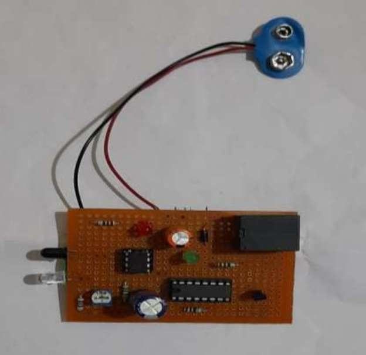
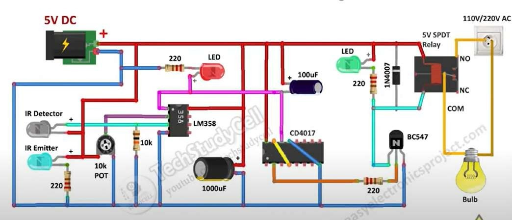

Overview:
This project demonstrates a low-cost, sensor-driven automatic light control system using CD4017 IC, LM358 comparator, IR sensors, and relay switching. It eliminates manual intervention, reduces energy consumption, and enhances convenience—especially for elderly or disabled users. Unlike microcontroller-based systems, this design relies purely on analog and digital components, making it simple, reliable, and educational.

Aim:
Automate home lighting based on motion detection and ambient light levels.
Showcase how basic digital logic can solve real-world problems without programming.
Provide real-time interaction using LEDs and relay-controlled AC bulbs.
Demonstrate outputs on seven-segment displays for user-friendly visualization.

Objectives:
Design a logic-based control circuit using CD4017.
Eliminate manual switching for convenience.
Optimize energy consumption for sustainability.
Integrate IR sensors and LDRs for environmental feedback.
Ensure cost-effective, scalable implementation.
Promote hands-on learning via simulation tools (Proteus, Multisim).
Lay groundwork for future extensions (timers, dimming, wireless control).

Components:
CD4017 IC – Decade counter for sequencing.
LM358 IC – Comparator for sensor signals.
BC547 Transistor – Drives relay.
Relay (5V SPDT) – Switches AC bulb load.
IR LED Pair – Motion/presence detection.
LDR (optional) – Ambient light sensing.
Resistors, Capacitors, Diode (1N4007) – Biasing, filtering, protection.
LED Indicators – Power and status feedback.

Tools:
Breadboard, Multimeter, Soldering kit.
Simulation software: Proteus, Multisim, LTspice.
PCB design tools: KiCad, Eagle, EasyEDA.
DIY PCB fabrication: JLCPCB, A4 print method.

Literature Insights:
Motion-based lighting reduces electricity use by ~30% in residential setups.
CD4017 enables sequential control without programming.
LM358 comparator converts analog sensor signals into digital logic.
Relay + transistor switching ensures safe AC load control.
Compared to microcontrollers, this design is simpler, cheaper, and robust.

Working Flow:
Power ON → Circuit energized.
IR Sensor detects motion → Signal generated.
LM358 comparator → Converts analog to digital HIGH.
CD4017 counter → Activates output pin.
BC547 transistor → Drives relay coil.
Relay switches AC bulb → Light ON.
Optional delay/reset → Light OFF after set time.
Cycle repeats → Waits for next motion.

Images:

Applications:
Residential: Bedrooms, hallways, bathrooms, staircases.
Assistive Tech: Elderly/disabled accessibility.
Energy Efficiency: Prevents unnecessary lighting, eco-friendly homes.
Educational: DIY automation, lab demonstrations.
Small Offices: Ambient light regulation for productivity.

Advantages:
Hands-free convenience.
Energy-efficient and eco-friendly.
No programming required.
Cost-effective and reliable.
Great educational value.
Scalable design for multiple zones.

Limitations:
Manual calibration required.
Limited precision due to component tolerances.
No programmability for advanced features.
Component aging may affect performance.
Bulky when scaled across multiple rooms.

Final Outcome:
The project delivers a stable, responsive, and energy-efficient automatic lighting system. It is:
Practical for real-world deployment.
Affordable and easy to build.
Educational for students and hobbyists.
Assistive for elderly/disabled individuals.
A strong foundation for future smart-home extensions.

References:
IJERT (2020) – Automatic Light Control System Using LDR and Relay.
IJARCCE (2016) – Design & Implementation of Automatic Room Light Controller.
JETIR (2024) – Automatic Room Light Controller.
IJARSCT (2023) – Automatic Lights Using PIR Sensor.

Future Scope:
Ambient Light Integration: Add LDR-based sensing to ensure lights only activate when natural light is insufficient.
Time-Based Control: Introduce programmable timers for scheduled ON/OFF cycles.
Wireless Connectivity: Extend with Wi-Fi/Bluetooth modules for remote monitoring and control.
Smart Dimming: Implement variable brightness control for energy optimization and comfort.
IoT & Cloud Integration: Connect to smart home ecosystems for centralized automation.
Scalable Deployment: Adapt design for multi-room or outdoor lighting systems.
Hybrid Systems: Combine analog simplicity with microcontroller flexibility for advanced features.

Skills Gained:
Circuit Design & Simulation: Hands-on experience with schematic creation, breadboard prototyping, and PCB design.
Sensor Interfacing: Practical knowledge of IR sensors, LDRs, and comparator calibration.
Analog & Digital Logic: Application of CD4017 counters, LM358 comparators, and relay-transistor switching.
Power Electronics: Understanding of AC/DC interfacing, relay protection, and flyback diode usage.
Troubleshooting & Optimization: Adjusting sensitivity, calibrating thresholds, and ensuring stable operation.
Documentation & Presentation: Preparing technical reports, flowcharts, block diagrams, and GitHub-ready content.
Sustainability Awareness: Linking automation projects to energy efficiency and eco-friendly practices.

Team V VAISHNAVI
Institution: Vellore Institute of Technology (VIT)

Support If you found this project inspiring, consider giving it a star on GitHub to support further development and encourage open-source innovation.

